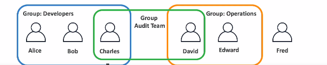
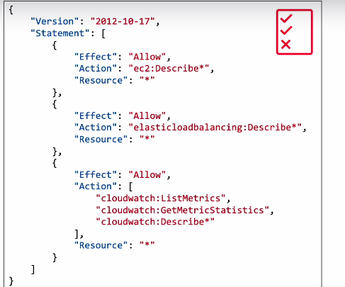

# Users & Groups

- IAM = Identity and Access Management, Global service

- Root account created by default, shouldn't be used or shared

- Users and people within your organization, and can be grouped

- Groups only contain users, not other groups

- Users don't have to belong to a group, and user can belong to mutiple groups.

    

# Permissions

- Users or Groups can be assigned JSON documents called policies

- These policies define the permissions of the users

- In AWS you apply the least privilege principle: don't give more permissions than a user needs.

    