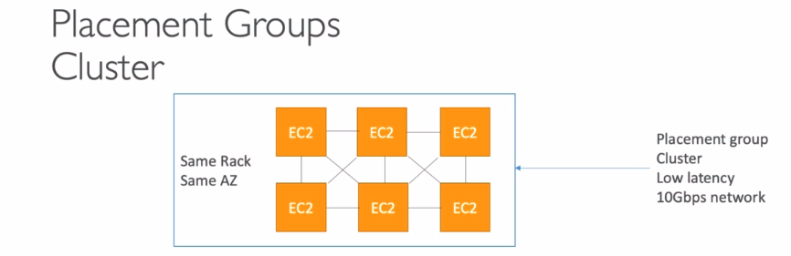
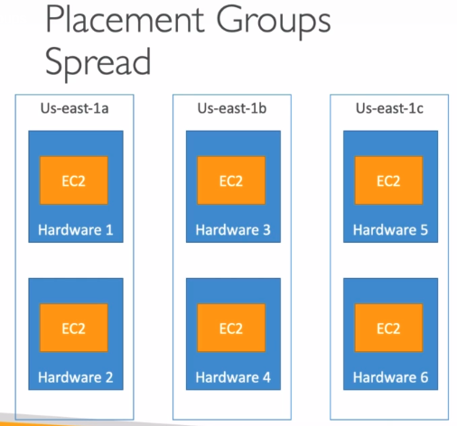
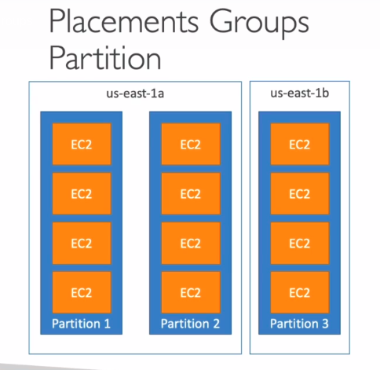

# Plaacement Groups

- Sometimes you want control over the EC2 Instance placement strategy

- That strategy can be defined using placement groups

- When you create a placement group, you specify one of the following strategies for the group:

    - Cluster-clusters instances into a low-latency group in a single Availability Zone

    - Spread-spreads instances across underlying hardware (max 7 instance per group per AZ) - critical apllications

    - Partition-spreads instances across many different partitions (which rely on different sets of racks) within an AZ. Sclaes to 100s EC2 instances per group (Hadoop, Cassandra,Kafka)

## Placement Groups Cluster

- Pros: Great network (10 Gbps bandwidth between instances)

- Cons: If the rack fails, all instances fails at the same time

- Use case:

    - Big Data job that needs to complete fast

    - Application that needs extremely low latency and high network throughput

    

## Placement Groups Spread

- Pros:

    - Can span across AZ

    - Reduced risk simultaneous failure

    - EC2 Instances are on different physical hardware

- Cons:

    - Limited to 7 instances per AZ per placement group

- Use case:

    - Applicaiton that needs to maximize high availability

    - Critical Applications where each instance must be isolated from failure from each other

    

## Placement Groups Partition

- Up to 7 partitions per AZ

- Can span across multiple AZs in the same region

- Up to 100s of EC2 instances

- The instances in a partition do not share racks with the instances in the other partitions

- A partition failure can affect many EC2 but wont affect other partitions

- EC2 instances get access to the partition information as metadata

- Use cases: HDFS, HBase, Cassandra, Kafka

