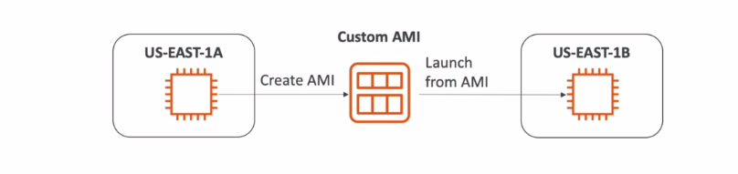

# AMI Overview

- AMI: Amazon Machine Image

- AMI are customization of an EC2 instance
    
    - You add your own software, configuration, operating system, monitoring....

    - Faster boot / configuration time because all your software is pre-packaged

- AMI are build for a specific region (and can be copied across regions)

- You can launch EC2 instances from:

    - A Public AMI: AWS provided

    - Your own AMI: yo make and maintain them yourself

    - An AWS Marketplace AMI: an AMI someone else mad (and potentially sells)

## AMI Process (from EC2 instance)

- Start an EC2 instance and customize it

- Stop the instance (for data integrity)

- Build an AM - this will also create EBS snapshots

- Launch instances from other AMIs

    