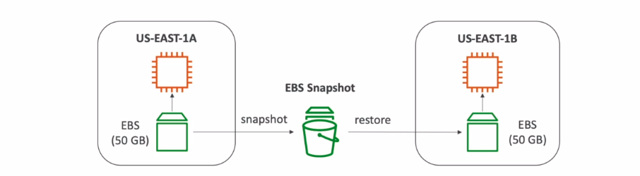

# EBS

## What is EBS?

- An EBS (Elastic Block Store) Volume is a network drive you can ttach to your instances while they run

- It allows your instances to persist data, even after their termination

- They can only be mounted to one instance at a time 

- They are bound to a specific availability zone

- Analogy: Think of them as a "network USB stick"

- It's a network drive (i.e. not a physical drive)

    - It uses the network to communicate the instance,  which means there might be a bit of latency

    - It can be detached from an EC2 instance and attached to another one quickly

- It's locked to an AZ

    - An EBS Volume in us-east-1a cannot be attached to us-east-1b

    - To move a volume across, you first need to snapshot it.

- Have a provisioned capacity (size in GBs, and IOPS)

    - You get billed for all the provisioned capacity

    - You can increase the capacity of the drive over time

## EBS - Delete on Termination attribute

- Controls the EBS behaviour when an EC2 instance terminates

    - By default, the root EBS volume is deleted (attribute enabled)

    - By default, any other attached EBS volume is not deleted (attribute disabled)

- This can be controlled by the AWS console / AWS CLI

- Use case: preserve root volume when instance is terminated

## EBS Snapshots

- Make a backup (snapshot) of your EBS volume at a point in time

- Not necessary to detach volume to do snapshot, but recommended

- Can copy snapshots across AZ or Region

    

## EBS Volume Types

- EBS Volumes come in 6 types

    - gp2 / gp3 (SSD): General purpose SSD volume that balances price and performance for a wide variety of workloads

    - io1/io2 (SSD): Highest-performnce SSD volume for mission-critical low-latency or high-throughput workloads

    - st1(HDD): Low cost HDD volume designe for frequently accessed, throughput-intensive worloads

    - sc1 (HDD): Lowest cost HDD volume designed for less frequently accessed workloads

- EBS Volumes are characterized in Size | Throughput | IOPS

- When in doubt always consult the AWS documentation - it's good

- Only gp2/gp3 and io1/io2 can be used as boot volumes

## EBS Encryption

- When you create an encrypted EBS volume, you get the following:

    - Data at rest is encrypted inside the volume

    - All the data in flight moving between the instance and the volume is encrypted

    - All snapshots are encrypted

    - All volumes created from the snapshot

- Encryption and decryption are handled transparently (you have nothing to do)

- Encryption has a minimal impact on latency

- EBS Encryption leverages keys from KMS (AES-256)

- Copying an unencrypted snapshot allows encryption

- Snapshots of encrypted volumes are encrypted