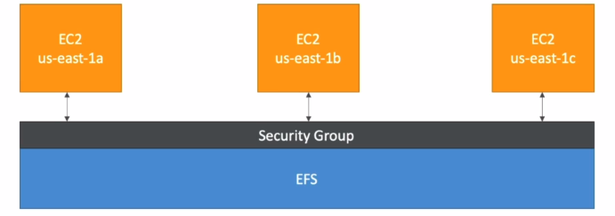

# EFS - Elastic File System

- Managed NFS (network file system) that can be mounted on many EC2

- EFS works with EC2 instances in multi-AZ

- Highly available, scalable, expensive (3x gp2), pay per use

    

- Use cases: content management, web serving, data sharing, Wordpress

- Uses NFSv4.1 protocol

- Uses security group to control access to EFS

- Compatible with Linux based AMI (not Windows)

- Encryption at rest using KMS

- POSIX file system (~Linux) that has a standard file APO

- File system scales automaticlly, pay-per-use, no capacity planning

