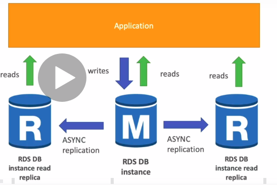
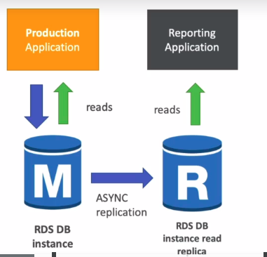
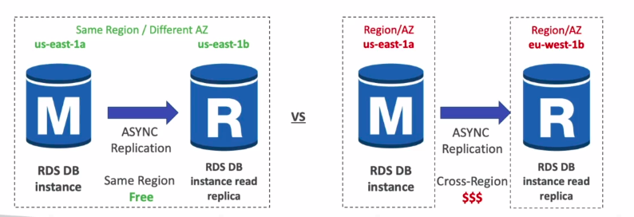
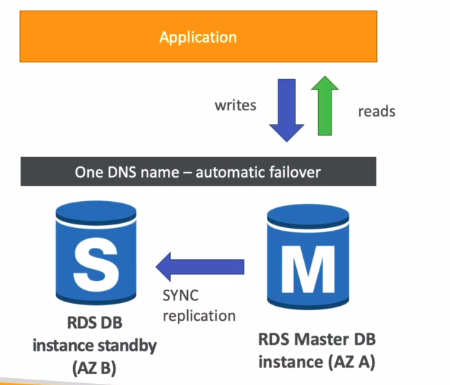

# AWS RDS Overview

- RDS stands for Relational Database Service

- It's a managed DB service for DB use SQL as a query language

- It allows you to create databases in the cloud that are managed by AWS

    - Postgres
    - MySQL
    - MariaDB
    - Oracle
    - Microsoft SQL Server
    - Aurora (AWS Proprietary database)

# Advantage over using RDS versus deploying DB on EC2

- RDS is a managed service:

    - Automated provisioning, OS patching

    - Continuous backups and restore to specific timestamp (Point in Time Restore)

    - Monitoring dashboards

    - Read replicas for improved read performance

    - Multi AZ setup for DR (Disaster Recovery)

    - Maintenance windows for upgrades

    - Scaling capability (vertical and horizontal)

    - Storage backed by EBS

- BUT you cant SSH into your instances

# RDS Backups

- Backups are automatically enabled in RDS

- Automated backups:

    - Daily full backup of the database (during the maintenance window)

    - Transaction logs are backed-up by RDS every 5 minutes => ability to restore to any point in time (from oldest backup to 5 minutes ago)

    - 7 days retention (can be increased to 35 days)

- DB snapshots:

 - Manually triggered by the user

 - Retention of backup for as long as you want

# RDS - Storage Auto Scaling

- Helps you increase storage on your RDS DB instance dynamically

- When RDS detects you are running out of free database storage, it scales automatically

- Avoid manually scaling your database storage

- You have to set Maximum Storage Threshold (maximum limit for DB storage)

- Automatically modify storage if:

    - Free storage is less than 10% of allicaed storage
    
    - Low-storage lasts at least 5 minutes

    - 6 hours have passed since last modification

- Useful for applications with unpredictable workloads

- Supports all RDS database engines (MariaDB, MySQL, PostgreSQL, SQL Server, Oracle)

# RDS Read Replicas for read scalability

- Up to 5 Read Replicas

- Within AZ, Cross AZ or Cross Region

- Replication is ASYNC, so reads are eventually consistent

- Replicas can be promoted to their own DB

- Applications must update the connection string to leverage read replicas

    

## Use cases:

   
 - You have a production database that í taking on normal load

- You want to run a reporting application to run some analytics

- You create a Read Replica to run the new workload there

- The production application is unaffected

- Read replicas are used for SELECT (read) only kind of statements (not INSERT, UPDATE, DELETE)

    

## RDS Read Replicas - Network cost

- In AWS there's a network cost when data goes from one AZ to another

- For RSD Read Replicas within the same region, you dont pay that fee

    

# RDS Multi AZ (Disaster Recovery)

- SYNC replication

- One DNS name -automatic app failover to standby

- Increase availability

- Failover in case of loss of AZ, loss of network, instance or storage failure

- No manual intervention in apps

- Not used for scaling

- Note: The Read Replicas be setup as Multi AZ for Disater Recovery (DR)

    